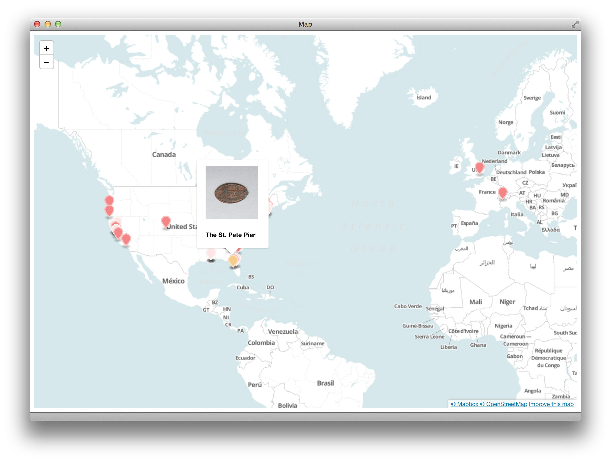

# Fullscreen Map from Spreadsheet

This creates a website with a fullscreen map of points from a Google Spreadsheet with latitude and longitude columns.

- View the sample [site](http://jlord.github.io/mappy).
- View the sample [spreadsheet](https://docs.google.com/a/github.com/spreadsheet/lv?key=0Ao5u1U6KYND7dGN5QngweVJUWE16bTRob0d2a3dCbnc).

## Fork and Make Your Own!

1. **Fork this project** (hit that button at the ⤴︎ top right).
2. Create a **new Google spreadsheet** with at least these two columns:
 - `lat`
 - `long`
4. Set your spreadsheet's **share** setting to "anyone with the link can **view**"
5. Click File -> **Publish to the web** -> Start Publishing and copy the URL it gives you.
6. **Give your spreadsheet some data**!
7. Back in GitHub, on your fork's page (it should be github.com/yourusername/mappy), **edit the `index.html` file**  by clicking the file name to view the file and then 'edit' to make changes. You must change:
 - The `URL` variable on **line 26** to the key (or full URL) from your spreadsheet.
 - On **line 32** replace `["placename", "photo-url"]` with column headers from your spreadsheet that you'd like to use in your map marker's popup.
  - If you don't want a popup, delete **lines 32 and 34**, and change **line 41** to `Sheetsee.addMarkerLayer(geoJSON, map)`.
8. If you want to change more things, go for it and checkout the comments in the file for suggetions.
9. **Commit your changes**. At the bottom of the page your editing on, click the green commit button.
10. **View your page!** Visit: `yousername.github.io/mappy` to see your page, live!

### What else?

Here are some other things you may want to do.

- **Change your repository's name**. Because maybe 'mappy' isn't right for you. Click the Settings icon on your fork's GitHub page to change the name.
- Add a **custom domain**. If you don't like the default github.io/repo naming scheme, you can use a custom domain that you own. Here are [instructions](https://help.github.com/articles/setting-up-a-custom-domain-with-github-pages) on how.
- **Change map tiles!** You can design your own with Mapbox [here](https://www.mapbox.com/editor/).
